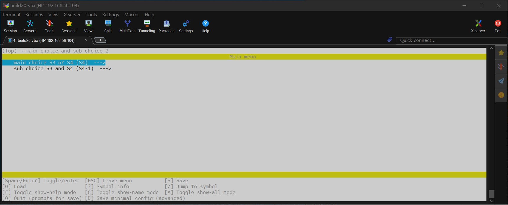
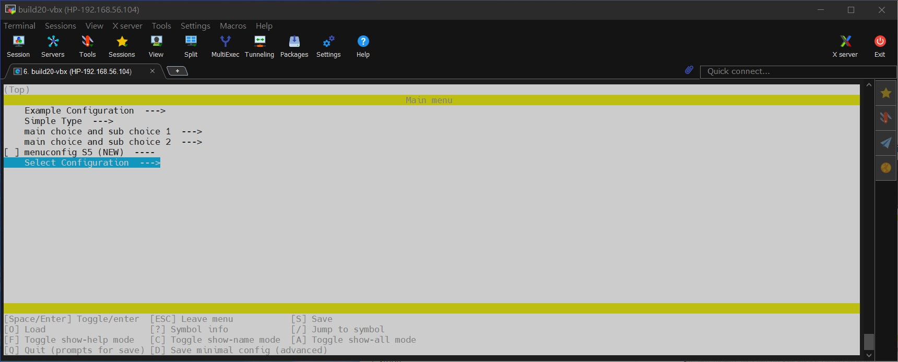
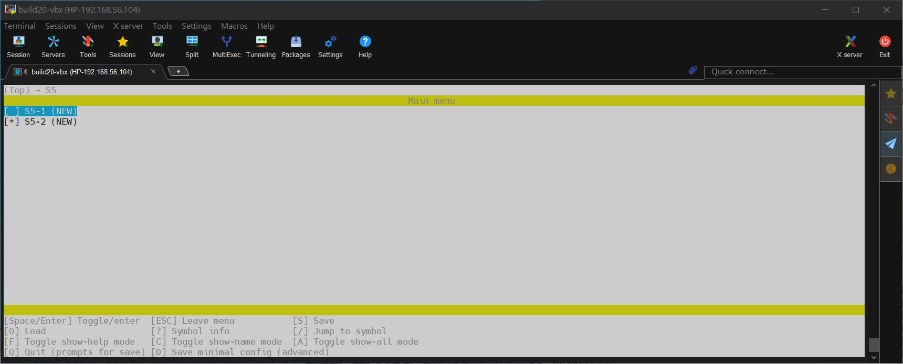

# Kconfig
[](https://github.com/lankahsu520/HelperX)
[![GitHub license][license-image]][license-url]
[![GitHub stars][stars-image]][stars-url]
[![GitHub forks][forks-image]][forks-url]
[![GitHub issues][issues-image]][issues-image]
[![GitHub watchers][watchers-image]][watchers-image]

[license-image]: https://img.shields.io/github/license/lankahsu520/HelperX.svg
[license-url]: https://github.com/lankahsu520/HelperX/blob/master/LICENSE
[stars-image]: https://img.shields.io/github/stars/lankahsu520/HelperX.svg
[stars-url]: https://github.com/lankahsu520/HelperX/stargazers
[forks-image]: https://img.shields.io/github/forks/lankahsu520/HelperX.svg
[forks-url]: https://github.com/lankahsu520/HelperX/network
[issues-image]: https://img.shields.io/github/issues/lankahsu520/HelperX.svg
[issues-url]: https://github.com/lankahsu520/HelperX/issues
[watchers-image]: https://img.shields.io/github/watchers/lankahsu520/HelperX.svg
[watchers-url]: https://github.com/lankahsu520/HelperX/watchers

# 1. Overview

>本篇不是要介紹語法，只是保留範本，供以後查詢。

> [ChatGPT] Kconfig 是什麼
>
> Kconfig 是一個配置系統，主要用於 Linux 核心及其他軟件項目中，來幫助用戶配置內核的構建選項。它通過定義配置選項及其相互依賴關係，使開發者能夠簡單且有條理地配置大型軟件項目。
>
> 以下是 Kconfig 的一些主要特點和功能：
>
> 1. **選項定義**：Kconfig 文件使用簡單的語法來定義配置選項。這些選項可以是布爾值、整數、字符串等。
> 2. **相互依賴**：選項之間可以設置依賴關係。例如，只有在某個選項被啟用的情況下，另一個選項才可見或可選。
> 3. **圖形化配置界面**：Kconfig 文件通常與 `menuconfig`、`xconfig` 等工具配合使用，這些工具提供圖形化或文本界面的配置方式，方便用戶選擇和設置各種配置選項。
> 4. **模塊化**：Kconfig 允許將配置選項模塊化，這意味著不同子系統或功能可以有各自獨立的配置文件，並通過主配置文件進行整合。
>
> ### 範例
>
> 以下是一個簡單的 Kconfig 文件範例：
>
> ```
> menu "Example Configuration"
> 
> config EXAMPLE_FEATURE
>     bool "Enable Example Feature"
>     default y
>     help
>       This is an example feature. Enable it to see the example in action.
> 
> config EXAMPLE_PARAMETER
>     int "Example Parameter"
>     default 10
>     depends on EXAMPLE_FEATURE
>     help
>       This parameter controls some aspect of the example feature.
> 
> endmenu
> ```
>
> 在這個範例中：
>
> - `menu "Example Configuration"` 開啟了一個新的配置菜單。
> - `config EXAMPLE_FEATURE` 定義了一個布爾選項 "Enable Example Feature"。
> - `config EXAMPLE_PARAMETER` 定義了一個整數選項 "Example Parameter"，該選項依賴於 `EXAMPLE_FEATURE`。
>
> ### 使用方法
>
> 在 Linux 核心源碼樹中，通常會執行以下命令來進入配置界面：
>
> ```
> bash
> Copy code
> make menuconfig
> ```
>
> 這將加載 Kconfig 文件並顯示配置選項，讓用戶可以選擇和配置。
>
> 總結來說，Kconfig 是一個強大的配置工具，用於簡化和組織大型軟件項目的配置過程，特別是在需要管理大量選項和依賴關係時。

# 2. make menuconfig vs. Kconfig

> 各位看了網路上的教學，為什麼執行 make menuconfig 後沒有看到 Kconfig 的介面。基本上 make 是沒有 UI 的，就算再打100遍也沒用。
>
> 這邊很清楚的告訴大家，網路上的文章很多是抄來抄去。欠實做！
>
> 想知詳情，請照著下面指令操作。（就會知道 make 是處理 Makefile 而不是處理 Kconfig）


## 2.1. python menuconfig

```bash
# 這邊使用 python menuconfig 安裝 kconfiglib
$ pip install --upgrade kconfiglib
$ vi Kconfig
```

```Kconfig
menu "Example Configuration"

config EXAMPLE_FEATURE
	bool "Enable Example Feature"
	default y
	help
		This is an example feature. Enable it to see the example in action.

config EXAMPLE_PARAMETER
	int "Example Parameter"
	default 10
	depends on EXAMPLE_FEATURE
	help
		This parameter controls some aspect of the example feature.
	comment "This is a comment of EXAMPLE_PARAMETER"
endmenu
```

```bash
function kconfig2config()
{
	DO_COMMAND="(python -m menuconfig Kconfig)"
	eval-it "$DO_COMMAND"
}
```

```bash
$ kconfig2config
[(python -m menuconfig Kconfig)]
Loaded configuration '.config'
```


## 2.2. .config and .config.old

```bash
$ ll .config*
-rw-rw-r-- 1 lanka lanka 188  五  17 11:00 .config
-rw-rw-r-- 1 lanka lanka 113  五  17 10:35 .config.old
```

## 2.3. config.h

```bash
function config2h()
{
	HINT="Usage: ${FUNCNAME[0]} <config> <config.h>"
	CONFIG1="$1"
	CONFIG_H2="$2"

	if [ ! -z "${CONFIG1}" ] && [ ! -z "${CONFIG_H2}" ]; then
		PJ_KCONFIG_CONFIG=${CONFIG1}
		PJ_KCONFIG_HEADER=${CONFIG_H2}
		rm -f ${PJ_KCONFIG_HEADER}
		echo "#" >> ${PJ_KCONFIG_HEADER}
		echo "# Generating ${PJ_KCONFIG_HEADER} from ${PJ_KCONFIG_CONFIG}" >> ${PJ_KCONFIG_HEADER}
		echo "#" >> ${PJ_KCONFIG_HEADER}
		sed -n 's/^\(CONFIG_[^=]*\)=\(.*\)/#define \1 \2/p' ${PJ_KCONFIG_CONFIG} >> ${PJ_KCONFIG_HEADER}
	else
		echo $HINT
	fi
}

function kconfig2h()
{
	DO_COMMAND="(config2h .config config.h)"
	eval-it "$DO_COMMAND"

	echo
	DO_COMMAND="(cat config.h)"
	eval-it "$DO_COMMAND"
}
```

```bash
$ kconfig2h
[(config2h .config config.h)]
#
# Generating config.h from .config
#
#define CONFIG_EXAMPLE_FEATURE y
#define CONFIG_EXAMPLE_PARAMETER 10
#define CONFIG_EXAMPLE_TRISTATE y
#define CONFIG_EXAMPLE_STRING "Hello World !"
#define CONFIG_EXAMPLE_HEX 0x01
#define CONFIG_EXAMPLE_INT 10
#define CONFIG_S1 y
#define CONFIG_S1_2 y
#define CONFIG_S3 y
#define CONFIG_S3_2 y
#define CONFIG_BLUETOOTH y
#define CONFIG_BLUEZ_556 y
[(cat config.h)]
#
# Generating config.h from .config
#
#define CONFIG_EXAMPLE_FEATURE y
#define CONFIG_EXAMPLE_PARAMETER 10
#define CONFIG_EXAMPLE_TRISTATE y
#define CONFIG_EXAMPLE_STRING "Hello World !"
#define CONFIG_EXAMPLE_HEX 0x01
#define CONFIG_EXAMPLE_INT 10
#define CONFIG_S1 y
#define CONFIG_S1_2 y
#define CONFIG_S3 y
#define CONFIG_S3_2 y
#define CONFIG_BLUETOOTH y
#define CONFIG_BLUEZ_556 y

```

# 3. Examples

## 3.1. Simple

#### - menu, config, int and depends on

```bash
[*] Enable Example Feature
(10)    Example Parameter
```
```Kconfig
menu "Example Configuration"
	config EXAMPLE_FEATURE
		bool "Enable Example Feature"
		default y
		help
			This is an example feature. Enable it to see the example in action.

	config EXAMPLE_PARAMETER
		int "Example Parameter"
		range 0 99
		default 10
		depends on EXAMPLE_FEATURE
		help
			This parameter controls some aspect of the example feature.
		comment "This is a comment of EXAMPLE_PARAMETER"
endmenu
```

#### - simple type

> bool：y/n
>
> tristate：y/m/n
>
> string：字串
>
> hex：十六進制
>
> int：整數

```bash
[ ] Enable EXAMPLE_BOOL
[*] Enable EXAMPLE_TRISTATE
(Hello World !) EXAMPLE_STRING - Please input string
(0x01) EXAMPLE_HEX - Please input hex
(10) EXAMPLE_INT - Please input integer

```

## 3.2. source

```Kconfig
source "select_example/Kconfig"
```

## 3.3. menu

#### - main choice and sub choice 1

> 此範例，當選擇 "S1"，就會有子項目 "S1_1" 和 "S1_2" 可選擇；如果選擇 "S2"，就會有子項目 "S2_1" 和 "S2_2" 可選擇。

```bash
├── S1
│   ├── S1_1
│   └── S1_2
└── S2
    ├── S2_1
    └── S2_2
```


```Kconfig
menu "main choice and sub choice 1"
	choice
		prompt	"main choice S1 and S2"
		default S1
		config	S1
			bool	"S1"
		config	S2
			bool	"S2"
	endchoice

	choice
		prompt	"sub choice of S1"
		default S1_2
		depends on S1
		config	S1_1
			bool	"S1-1"
		config	S1_2
			bool	"S1-2"
	endchoice

	choice
		prompt	"sub choice S2"
		default S2_1
		depends on S2
		config	S2_1
			bool	"S2-1"
		config	S2_2
			bool	"S2-2"
	endchoice
endmenu
```

#### - main choice and sub choice 2

>此範例，跟前一範例相似，只是寫法不同。

```bash
├── S3
│   ├── S3_1
│   └── S3_2
└── S4
    ├── S4_1
    └── S4_2
```



```Kconfig
menu "main choice and sub choice 2"
	choice
		prompt	"main choice S3 or S4"
		config	S3
			bool "S3"
		config	S4
			bool	"S4"
	endchoice

	choice
		prompt	"sub choice S3 and S4"
		default S3_2

		config	S3_1
			bool	"S3-1"
			depends on S3
		config	S3_2
			bool	"S3-2"
			depends on S3
		config	S4_1
			bool	"S4-1"
			depends on S4
		config	S4_2
			bool	"S4-2"
			depends on S4
	endchoice
endmenu
```

#### - menuconfig and if

> 此範例，當選擇 "S5"，就會有子項目 "S5_1" 和 "S5_2" 可選擇。

```bash
└── S5
    ├── S5_1
    └── S5_2
```




```Kconfig
menuconfig S5
	bool "menuconfig S5"
	default n
	
	if S5
		config S5_1
		bool "S5-1"
		default n
		
		config S5_2
		bool "S5-2"
		default y
	endif
```

#### - select

> 此範例，當選擇 "Enable Bluetooth"，就會自動選擇 "BlueZ 5.56"。

```bash
[*] Enable Bluetooth
-*- BlueZ 5.56
```

```Kconfig
config BLUETOOTH
	bool "Enable Bluetooth"
	default y
	select BLUEZ_556
	help
		Enable Bluetooth.

config BLUEZ_556
	bool "BlueZ 5.56"
	default n
```

# Appendix

# I. Study

## I.1. [Kconfig Language](https://www.kernel.org/doc/html/next/kbuild/kconfig-language.html)

# II. Debug

## II.1. WARNING: Menuconfig may fail because of the TERM environment variable is set to "xterm".

```bash
$ echo $TERM
xterm
$ export TERM=linux
```

# III. Glossary

# IV. Tool Usage

# Author

> Created and designed by [Lanka Hsu](lankahsu@gmail.com).

# License

> [Kconfig-123](https://github.com/lankahsu520/makeXcmakeXmesonXgn) is available under the BSD-3-Clause license. See the LICENSE file for more info.
