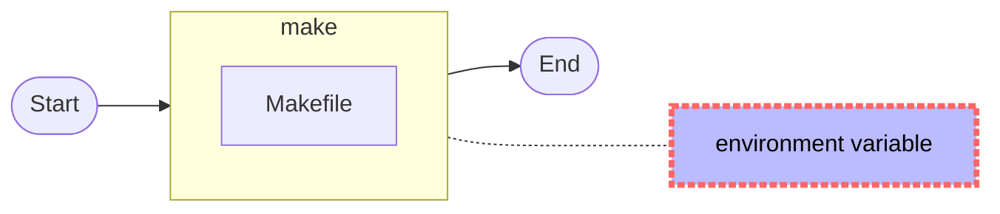
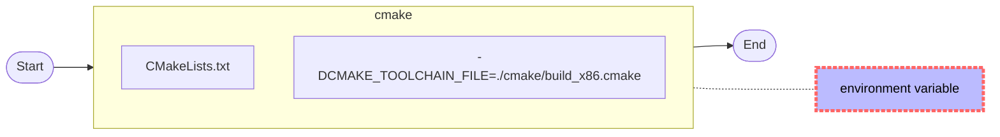
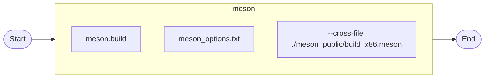

# 1. Overview

> 此處只是提供簡單的範例。
>
> 有時編譯 Open-source 常會遇到某些語法不清楚或錯誤時，上網路也找不著相關的教學，這時便是寫個相似的語法進行除錯，剛好這個範例提供了框架，方便進行修改和測試。
>
> 網路上有討論各個編譯時的快或慢，但在絕對的電腦下，速度不是問題；反而好除錯、好移植才是好的“自動化構建”。

## 1.1. make

> 就想像是 Shell Script 的進化版本，提供相依性，除錯相對的直覺化。



## 1.2. cmake

>其實已經習慣 make 的運作，cmake 反而是多餘。




## 1.3. meson

> meson_options.txt 要與 meson.build (第一個讀取的) 放在同一層目錄。
>
> meson 的限制很多，如
>
> ​	不支援讀取 environment variable。
>
> ​	meson.build:1:0: ERROR: prefix value './install' must be an absolute path。
>
> 這些都對於 Cross-Compilation 是很不友善的。
>
> 另外對於一個大專案，有 make, Perl, shell script, cmake 等混合之編譯環境， 就是這麼困難修改。



# 2. Depend on


# 3. Current Status


# 4. Build

## 4.1. make

```bash
$ ./build-make.sh distclean
$ ./build-make.sh start
$ tree install/
install/
├── bin
│   ├── helloworld
│   └── pipe2
├── include
│   └── helloworld_dbg.h
└── lib
    ├── libhelloworld.so -> libhelloworld.so.1
    ├── libhelloworld.so.1 -> libhelloworld.so.1.0.0
    └── libhelloworld.so.1.0.0

3 directories, 6 files

```
>大致的命令如下

```bash
$ . confs/simple.conf
$ (make )
$ (make install)
```

## 4.2. cmake

```bash
$ ./build-cmake.sh distclean
$ ./build-cmake.sh start
$ tree install/
install/
├── bin
│   ├── helloworld
│   └── pipe2
├── include
│   └── helloworld_dbg.h
└── lib
    ├── libhelloworld.so -> libhelloworld.so.1
    ├── libhelloworld.so.1 -> libhelloworld.so.1.0.0
    └── libhelloworld.so.1.0.0

3 directories, 6 files

$ ll install_Cpack/
total 64
drwxrwxr-x  3 lanka lanka  4096  七  13 23:20 ./
drwxrwxr-x 10 lanka lanka  4096  七  13 23:20 ../
drwxrwxr-x  3 lanka lanka  4096  七  13 23:20 _CPack_Packages/
-rw-rw-r--  1 lanka lanka 16206  七  13 23:20 helloworld-0.0.1-Linux.deb
-rw-rw-r--  1 lanka lanka 15388  七  13 23:20 helloworld-0.0.1-Linux.tar.gz
-rw-rw-r--  1 lanka lanka 19880  七  13 23:20 helloworld-0.0.1-Linux.zip

```

> 大致的命令如下

```bash
$ . confs/simple.conf
$ (mkdir -p build_xxx)
$ (cd build_xxx; cmake -DCMAKE_INSTALL_PREFIX=/work/codebase/lankahsu520-gitlab/helloworld/install -DCMAKE_TOOLCHAIN_FILE=/work/codebase/lankahsu520-gitlab/helloworld/cmake/build_x86.cmake  ..)
$ (cd  build_xxx; make )
$ (cd  build_xxx; make install)
$ (cd build_xxx; make package)

```

## 4.3. meson

```bash
$ ./build-meson.sh distclean
$ ./build-meson.sh start
$ tree install/
install/
├── bin
│   ├── helloworld
│   └── pipe2
├── include
│   └── helloworld_dbg.h
└── lib
    ├── libhelloworld_dbg.so -> libhelloworld_dbg.so.0
    ├── libhelloworld_dbg.so.0 -> libhelloworld_dbg.so.0.0.1
    └── libhelloworld_dbg.so.0.0.1

3 directories, 6 files

```

> 大致的命令如下

```bash
$ (mkdir -p build_xxx)
$ (cp -vf /work/codebase/lankahsu520-gitlab/helloworld/meson_public/meson_options.txt /work/codebase/lankahsu520-gitlab/helloworld/meson_options.txt)
$ (meson build_xxx --prefix /work/codebase/lankahsu520/helloworld/install --cross-file /work/codebase/lankahsu520/helloworld/build.meson)
$ (ninja  -C build_xxx)
$ (ninja  -C build_xxx install)

```

# 5. Example or Usage

```bash


```

# 6. License
helloworld is under the New BSD License (BSD-3-Clause).

# 7. Documentation

## 7.1. [The Meson Build system](https://mesonbuild.com/index.html)

## 7.2. [An Introduction to Modern CMake](https://cliutils.gitlab.io/modern-cmake/)

## 7.3. [CMake Tutorial](https://cmake.org/cmake/help/latest/guide/tutorial/)

## 7.4. [Check if a Library Is 32-Bit or 64-Bit](https://www.baeldung.com/linux/check-library-32-or-64-bit)

#### A. objdump

```bash
$ objdump -f  build_xxx/libhelloworld.so

build_xxx/libhelloworld.so:     file format elf64-x86-64
architecture: i386:x86-64, flags 0x00000150:
HAS_SYMS, DYNAMIC, D_PAGED
start address 0x0000000000001040

$ objdump -f  build_xxx/libhelloworld.a
In archive build_xxx/libhelloworld.a:

helloworld_dbg.c.o:     file format elf64-x86-64
architecture: i386:x86-64, flags 0x00000011:
HAS_RELOC, HAS_SYMS
start address 0x0000000000000000

```

#### B. file

```bash
$ file build_xxx/libhelloworld.so.0.0.1
build_xxx/libhelloworld.so.0.0.1: ELF 64-bit LSB shared object, x86-64, version 1 (SYSV), dynamically linked, BuildID[sha1]=a40027cd19af73a2a7e8a278b3f060dae18a594a, with debug_info, not stripped

$ file build_xxx/libhelloworld.a
build_xxx/libhelloworld.a: current ar archive

```


# Appendix

# I. Study
# II. Debug
