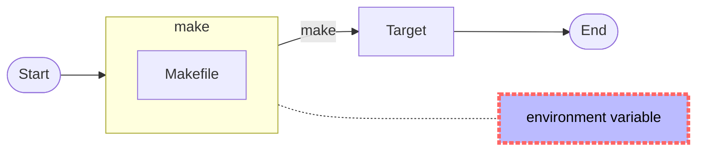
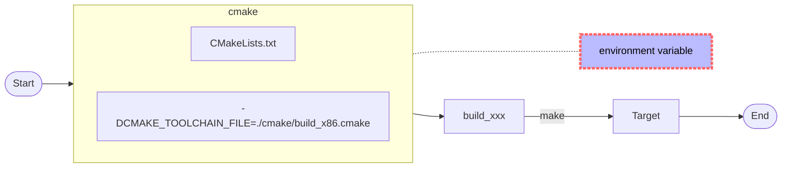
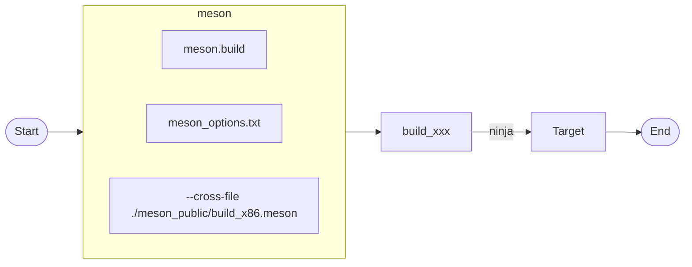
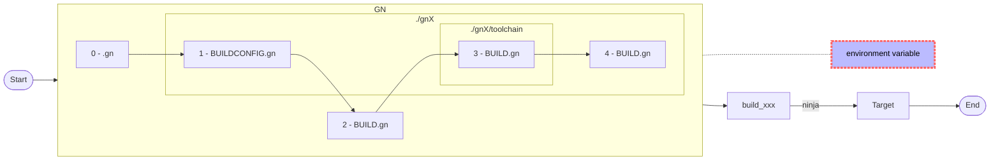

# 1. Overview

> 此處只是提供簡單的範例。
>
> 有時編譯 Open-source 常會遇到某些語法不清楚或錯誤時，上網路也找不著相關的教學，這時便是寫個相似的語法進行除錯，剛好這個範例提供了框架，方便進行修改和測試。
>
> 網路上有討論各個編譯時的快或慢，但在絕對的電腦下，速度不是問題；反而好除錯、好移植才是好的“自動化構建”。
>
> 構建工具只是輔助工具，我們要的是完成構建後的成果。身為軟體工程師的職責不應該花大時間去學寫構建工具，而構建工具越多 functions 和變異，越是造成進入門檻，請大家認真去思考這問題。

## 1.1. make

> 就想像是 Shell Script 的進化版本，提供相依性，除錯相對的直覺化。



## 1.2. cmake

>其實已經習慣 make 的運作，cmake 反而是多餘。
>
>請勿在 install - DESTINATION (CMakeLists.txt) 加入 CMAKE_INSTALL_PREFIX。




## 1.3. meson

> meson_options.txt 要與 meson.build (第一個讀取的) 放在同一層目錄。
>
> meson 的限制很多，如
>
> ​	不支援讀取 environment variable。
>
> ​	meson.build:1:0: ERROR: prefix value './install' must be an absolute path。
>
> 這些都對於 Cross-Compilation 是很不友善的。
>
> 另外對於一個大專案，有 make, Perl, shell script, cmake 等混合之編譯環境， 就是這麼困難修改。



## 1.4. [GN (Generate Ninja)](https://gn.googlesource.com/gn/)

> GN is a meta-build system that generates build files for [Ninja](https://ninja-build.org/).

>對於老古板的我，擁有 make 和 Shellscript 就已經很滿足了，而且也很夠用。而使用 GN 也只是要處理 Open-source 附加需要的工具。
>
>學習另一套構建工具，只會佔用開發時間，就算號稱編譯時的神速，也是九牛一毛。另外如 meson 時所提及的，在混合編譯環境下，這些構建工具反而是阻礙。所以在你還沒把現有的專案轉至這些構建工具，請三思而後行。

><font color="red">連安裝都很麻煩，請確定真的要用。</font>
>
><font color="red">所有 .gn、BUILD.gn 都要用 space 來縮排。</font>
>
><font color="red">排除官方的 guide，市面上可找到的說明或範例，少！而且不精確的地方都跟官網一樣。</font>

```bash
$ sudo apt install -y ninja-build
$ ninja --version
1.10.0

# 自編
$ sudo apt install -y clang
$ clang --version
clang version 10.0.0-4ubuntu1
Target: x86_64-pc-linux-gnu
Thread model: posix
InstalledDir: /usr/bin
$ git clone https://gn.googlesource.com/gn
$ cd gn
$ python build/gen.py
$ ninja -C out
$ sudo cp out/gn /usr/bin
$ sudo cp out/gn_unittests /usr/bin
$ gn --version
2124 (e4702d740906)

```

# 2. Depend on


# 3. Current Status


# 4. Build

## 4.1. make

```bash
$ ./build-make.sh distclean
$ ./build-make.sh build
$ tree install/
install/
├── bin
│   ├── helloworld
│   └── pipe2
├── include
│   └── helloworld_dbg.h
└── lib
    ├── libhelloworld.so -> libhelloworld.so.1
    ├── libhelloworld.so.1 -> libhelloworld.so.1.0.0
    └── libhelloworld.so.1.0.0

3 directories, 6 files

```
>大致的命令如下

```bash
$ . confs/simple.conf
$ (make )
$ (make install)
```

## 4.2. cmake & make

```bash
$ ./build-cmake.sh distclean
$ ./build-cmake.sh build
$ tree install/
install/
├── bin
│   ├── helloworld
│   └── pipe2
├── include
│   └── helloworld_dbg.h
└── lib
    ├── libhelloworld.so -> libhelloworld.so.1
    ├── libhelloworld.so.1 -> libhelloworld.so.1.0.0
    └── libhelloworld.so.1.0.0

3 directories, 6 files

$ ll install_Cpack/
total 64
drwxrwxr-x  3 lanka lanka  4096  七  13 23:20 ./
drwxrwxr-x 10 lanka lanka  4096  七  13 23:20 ../
drwxrwxr-x  3 lanka lanka  4096  七  13 23:20 _CPack_Packages/
-rw-rw-r--  1 lanka lanka 16206  七  13 23:20 helloworld-0.0.1-Linux.deb
-rw-rw-r--  1 lanka lanka 15388  七  13 23:20 helloworld-0.0.1-Linux.tar.gz
-rw-rw-r--  1 lanka lanka 19880  七  13 23:20 helloworld-0.0.1-Linux.zip

```

> 大致的命令如下

```bash
$ . confs/simple.conf
$ (mkdir -p build_xxx)
$ (cd build_xxx; cmake -DCMAKE_INSTALL_PREFIX=/work/codebase/lankahsu520-gitlab/helloworld/install -DCMAKE_TOOLCHAIN_FILE=/work/codebase/lankahsu520-gitlab/helloworld/cmake/build_x86.cmake  ..)
$ (cd  build_xxx; make )
$ (cd  build_xxx; make install)
$ (cd build_xxx; make package)

```

## 4.3. meson & ninja

```bash
$ ./build-meson.sh distclean
$ ./build-meson.sh build
$ tree install/
install/
├── bin
│   ├── helloworld
│   └── pipe2
├── include
│   └── helloworld_dbg.h
└── lib
    ├── libhelloworld_dbg.so -> libhelloworld_dbg.so.0
    ├── libhelloworld_dbg.so.0 -> libhelloworld_dbg.so.0.0.1
    └── libhelloworld_dbg.so.0.0.1

3 directories, 6 files

```

> 大致的命令如下

```bash
$ (mkdir -p build_xxx)
$ (cp -vf /work/codebase/lankahsu520-gitlab/helloworld/meson_public/meson_options.txt /work/codebase/lankahsu520-gitlab/helloworld/meson_options.txt)
$ (meson build_xxx --prefix /work/codebase/lankahsu520/helloworld/install --cross-file /work/codebase/lankahsu520/helloworld/build.meson)
$ (ninja  -C build_xxx)
$ (ninja  -C build_xxx install)

```

## 4.4. GN

```bash
$ ./build-gn.sh distclean
$ ./build-gn.sh build

```

> 大致的命令如下

```bash
$ (mkdir -p build_xxx)
$ (gn gen -C build_xxx)
$ (ninja -v -C build_xxx)

```

# 5. Example or Usage

```bash


```

# 6. License
> makeXcmakeXmeson is under the New BSD License (BSD-3-Clause).

# 7. Documentation

> Run an example and read it.

# Appendix

# I. Study

## I.1. [The Meson Build system](https://mesonbuild.com/index.html)

## I.2. [An Introduction to Modern CMake](https://cliutils.gitlab.io/modern-cmake/)

## I.3. [CMake Tutorial](https://cmake.org/cmake/help/latest/guide/tutorial/)

## I.4. [Check if a Library Is 32-Bit or 64-Bit](https://www.baeldung.com/linux/check-library-32-or-64-bit)

#### A. objdump

```bash
$ objdump -f  build_xxx/libhelloworld.so

build_xxx/libhelloworld.so:     file format elf64-x86-64
architecture: i386:x86-64, flags 0x00000150:
HAS_SYMS, DYNAMIC, D_PAGED
start address 0x0000000000001040

$ objdump -f  build_xxx/libhelloworld.a
In archive build_xxx/libhelloworld.a:

helloworld_dbg.c.o:     file format elf64-x86-64
architecture: i386:x86-64, flags 0x00000011:
HAS_RELOC, HAS_SYMS
start address 0x0000000000000000

```

#### B. file

```bash
$ file build_xxx/libhelloworld.so.0.0.1
build_xxx/libhelloworld.so.0.0.1: ELF 64-bit LSB shared object, x86-64, version 1 (SYSV), dynamically linked, BuildID[sha1]=a40027cd19af73a2a7e8a278b3f060dae18a594a, with debug_info, not stripped

$ file build_xxx/libhelloworld.a
build_xxx/libhelloworld.a: current ar archive

```

## I.5. [GN Quick Start guide](https://gn.googlesource.com/gn/+/main/docs/quick_start.md)

> 這是很失敗的 guide，短短一篇文章，在對 gn 還沒有一定的熟悉下，是完全不知其所道。
>
> 舉例，如在章節 Passing build arguments，
>
> ```bash
> gn args out/my_build
> ```
> 照著指示操作，新增了 args ，但是呢 ? 怎麼用 ?
>
> 而且 "gn args --list"  也沒有相應的資料，總之從一開始到放棄只要10分鐘。

## I.6. [GN Reference](https://gn.googlesource.com/gn/+/main/docs/reference.md)

## I.7. [How GN handles cross-compiling](https://gn.googlesource.com/gn/+/main/docs/cross_compiles.md)

# II. Debug

## II.1. The variable "is_component_build" was set as a build argument but never appeared in a declare_args() block in any buildfile.

>WARNING at build arg file (use "gn args <out_dir>" to edit):2:22: Build argument has no effect.
>is_component_build = true
>                     ^---
>The variable "is_component_build" was set as a build argument
>but never appeared in a declare_args() block in any buildfile.
>
>To view all possible args, run "gn args --list <out_dir>"
>
>The build continued as if that argument was unspecified.

> 建議在 gnX/BUILDCONFIG.gn 新增

```bash
declare_args()
{
  is_component_build = true
  is_debug = false
}
```


