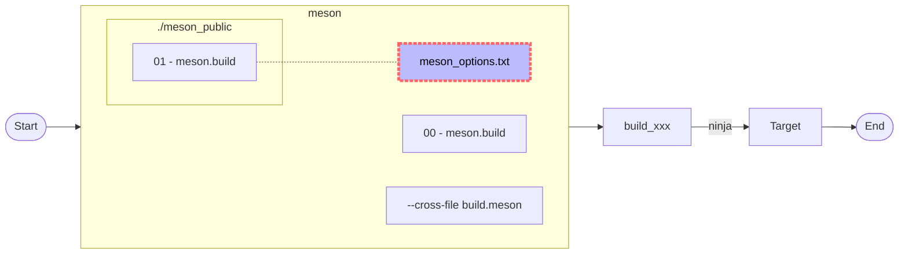
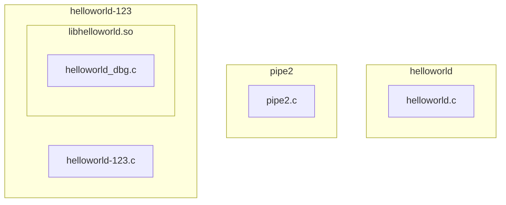

# 1. Overview

> 此處只是提供簡單的範例。
>
> 有時編譯 Open-source 常會遇到某些語法不清楚或錯誤時，上網路也找不著相關的教學，這時便是寫個相似的語法進行除錯，剛好這個範例提供了框架，方便進行修改和測試。
>
> 網路上有討論各個編譯時的快或慢，但在絕對的電腦下，速度不是問題；反而好除錯、好移植才是好的“自動化構建”。
>
> 構建工具只是輔助工具，我們要的是完成構建後的成果。身為軟體工程師的職責不應該花大時間去學寫構建工具，而構建工具越多 functions 和變異，越是造成進入門檻，請大家認真去思考這問題。

## 1.1. make

> 就想像是 Shell Script 的進化版本，提供相依性，除錯相對的直覺化。


## 1.2. cmake

>其實已經習慣 make 的運作，cmake 反而是多餘。
>
>請勿在 install - DESTINATION (CMakeLists.txt) 加入 CMAKE_INSTALL_PREFIX。


>  <font color="red">cmake 3.xx vs 4.xx，不相容，請珍惜自己的保貴時間。退回 3.xx。</font>

```bash
# Install specific package version, 最新版可能造成的問題更多
$ pip install cmake==3.31.4
```

## 1.3. meson

> meson_options.txt 要與 meson.build (第一個讀取的) 放在同一層目錄。
>
> meson 的限制很多，如
>
> ​	不支援讀取 environment variable。
>
> ​	meson.build:1:0: ERROR: prefix value './install' must be an absolute path。
>
> 這些都對於 Cross-Compilation 是很不友善的。
>
> 另外對於一個大專案，有 make, Perl, shell script, cmake 等混合之編譯環境， 就是這麼困難修改。
>
> 有時要解決 python 版本的問題，真的很浪費時間。



```bash
# meson 0.53 在 cross 時會出問題，請不要使用
# upgrade meson to 0.63
$ pip3 install meson==0.63
```

## 1.4. [GN (Generate Ninja)](https://gn.googlesource.com/gn/)

> GN is a meta-build system that generates build files for [Ninja](https://ninja-build.org/).

>對於老古板的我，擁有 make 和 Shellscript 就已經很滿足了，而且也很夠用。而使用 GN 也只是要處理 Open-source 附加需要的工具。
>
>學習另一套構建工具，只會佔用開發時間，就算號稱編譯時的神速，也是九牛一毛。另外如 meson 時所提及的，在混合編譯環境下，這些構建工具反而是阻礙。所以在你還沒把現有的專案轉至這些構建工具，請三思而後行。

><font color="red">連安裝都很麻煩，請確定真的要用。</font>
>
><font color="red">所有 .gn、BUILD.gn 都要用 space 來縮排。</font>
>
><font color="red">gn 建構後，檔案無法從 output 中  copy 出來，所以沒有 ninja install。 </font>
>
><font color="red">排除官方的 guide，市面上可找到的說明或範例，少！而且不精確的地方都跟官網一樣。</font>

```bash
$ sudo apt install -y ninja-build
$ ninja --version
1.10.0

# 自編
$ sudo apt install -y clang
$ clang --version
clang version 10.0.0-4ubuntu1
Target: x86_64-pc-linux-gnu
Thread model: posix
InstalledDir: /usr/bin
$ git clone https://gn.googlesource.com/gn
$ cd gn
$ python build/gen.py
$ ninja -C out
$ sudo cp out/gn /usr/bin
$ sudo cp out/gn_unittests /usr/bin
$ gn --version
2124 (e4702d740906)

```

```mermaid
flowchart LR
	Start([Start])
	subgraph GN[GN]
		direction LR
		.gn[00 - .gn]
		BUILD.gn[02 - BUILD.gn]
		subgraph gnX[./gnX]
			direction LR
			BUILD.gn-gnX[03 - BUILD.gn]
			BUILDCONFIG.gn[01 - BUILDCONFIG.gn]
			subgraph toolchain[./gnX/toolchain]
				BUILD.gn-toolchain[03 - BUILD.gn]
			end
		end
		subgraph cCaller[./cppTest]
			BUILD.gn-cCaller[03 - BUILD.gn]
		end
		.gn --> BUILDCONFIG.gn --> BUILD.gn 
	end
	End([End])
	
	environment[environment variable]
	style environment fill:#bbf,color:#000000,stroke:#f66,stroke-width:4px,stroke-dasharray: 5 2

	Start --> GN --> build_xxx --> |ninja|Target --> End
	GN -..- environment
```

# 2. Depend on

- [CrossCompilationX](https://github.com/lankahsu520/CrossCompilationX)
- [KconfigX](https://github.com/lankahsu520/KconfigX/blob/main/README.md)

# 3. Current Status


# 4. Build



## 4.1. Native-Compilation

#### A. make

```bash
$ ./build-make.sh distclean
$ ./build-make.sh build
$ tree install/
install/
├── bin
│   ├── helloworld
│   ├── helloworld-123
│   └── pipe2
├── include
│   └── helloworld_dbg.h
└── lib
    ├── libhelloworld.so -> libhelloworld.so.0
    ├── libhelloworld.so.0 -> libhelloworld.so.0.0.1
    └── libhelloworld.so.0.0.1

3 directories, 7 files

```
>大致的命令如下

```bash
$ . confs/simple_x86.conf
$ (make )
$ (make install)
```

#### B. cmake & make

```bash
$ ./build-cmake.sh distclean
$ ./build-cmake.sh build
$ tree install/
install/
├── bin
│   ├── helloworld
│   ├── helloworld-123
│   └── pipe2
├── include
│   └── helloworld_dbg.h
└── lib
    ├── libhelloworld.so -> libhelloworld.so.0
    ├── libhelloworld.so.0 -> libhelloworld.so.0.0.1
    └── libhelloworld.so.0.0.1

3 directories, 7 files

$ ll install_Cpack/
total 80
drwxrwxr-x  3 lanka lanka  4096 十一 20 10:11 ./
drwxrwxr-x 12 lanka lanka  4096 十一 20 10:11 ../
drwxrwxr-x  3 lanka lanka  4096 十一 20 10:06 _CPack_Packages/
-rw-rw-r--  1 lanka lanka 18578 十一 20 10:11 helloworld-123-0.0.1-Linux.deb
-rw-rw-r--  1 lanka lanka 17856 十一 20 10:11 helloworld-123-0.0.1-Linux.tar.gz
-rw-rw-r--  1 lanka lanka 24714 十一 20 10:11 helloworld-123-0.0.1-Linux.zip

```

> 大致的命令如下

```bash
$ . confs/simple_x86.conf
$ (mkdir -p build_xxx)
$ (cd build_xxx; cmake -DCMAKE_INSTALL_PREFIX=/work/codebase/lankahsu520-gitlab/helloworld/install -DCMAKE_TOOLCHAIN_FILE=/work/codebase/lankahsu520-gitlab/helloworld/cmake/build_x86.cmake  ..)
$ (cd build_xxx; make )
$ (cd build_xxx; make install)
$ (cd build_xxx; make package)

```

#### C. meson & ninja

```bash
$ ./build-meson.sh distclean
$ ./build-meson.sh build
$ tree install/
install/
├── bin
│   ├── helloworld
│   ├── helloworld-123
│   └── pipe2
├── include
│   └── helloworld_dbg.h
└── lib
    ├── libhelloworld_dbg.so -> libhelloworld_dbg.so.0
    ├── libhelloworld_dbg.so.0 -> libhelloworld_dbg.so.0.0.1
    └── libhelloworld_dbg.so.0.0.1

3 directories, 7 files

```

> 大致的命令如下

```bash
$ . confs/simple_x86.conf
$ (mkdir -p build_xxx)
$ (cp -vf /work/codebase/lankahsu520-gitlab/helloworld/meson_public/meson_options.txt /work/codebase/lankahsu520-gitlab/helloworld/meson_options.txt)
$ (cp -vf /work/codebase/lankahsu520/makeXcmakeXmesonXgn/meson_public/build_x86.meson /work/codebase/lankahsu520/makeXcmakeXmesonXgn/build.meson)
$ (meson build_xxx --prefix /work/codebase/lankahsu520/helloworld/install --cross-file /work/codebase/lankahsu520/helloworld/build.meson)
$ (ninja  -C build_xxx)
$ (ninja  -C build_xxx install)

```

#### D. GN

```bash
$ ./build-gn.sh distclean
$ ./build-gn.sh build
$ tree install/
install/
├── bin
│   ├── cppCaller
│   ├── cppHelloWorldv2
│   ├── helloworld
│   ├── helloworld-123
│   └── pipe2
├── include
│   └── helloworld_dbg.h
└── lib
    └── libhelloworld.so

3 directories, 7 file

```

> 大致的命令如下

```bash
$ . confs/simple_x86.conf
$ (mkdir -p build_xxx)
$ (gn gen -C build_xxx)
$ (ninja -v -C build_xxx)
$ (mkdir -p /work/codebase/lankahsu520/makeXcmakeXmesonXgn/install/bin; cp -avr build_xxx/bin/* /work/codebase/lankahsu520/makeXcmakeXmesonXgn/install/bin)
$ (mkdir -p /work/codebase/lankahsu520/makeXcmakeXmesonXgn/install/include; cp -avr build_xxx/include/* /work/codebase/lankahsu520/makeXcmakeXmesonXgn/install/include)
$ (mkdir -p /work/codebase/lankahsu520/makeXcmakeXmesonXgn/install/lib; cp -avr build_xxx/lib/* /work/codebase/lankahsu520/makeXcmakeXmesonXgn/install/lib)

```

## 4.2. Cross-Compilation (aarch64)

> Please install aarch64-buildroot-linux-gnu_sdk-buildroot.tar.gz into your system.
>
> You can check [helper_Buildroot-RaspberryPi3.md](https://github.com/lankahsu520/HelperX/blob/master/helper_Buildroot-RaspberryPi3.md) - Buildroot Raspberry Pi 3 helper,
>
> 2.2. To Generate Toolchain.

#### A. make

```bash
$ ./build-make.sh distclean
$ ./build-make.sh build aarch64
$ tree install/
install/
├── bin
│   ├── helloworld
│   ├── helloworld-123
│   └── pipe2
├── include
│   └── helloworld_dbg.h
└── lib
    ├── libhelloworld.so -> libhelloworld.so.0
    ├── libhelloworld.so.0 -> libhelloworld.so.0.0.1
    └── libhelloworld.so.0.0.1

3 directories, 7 files

$ file install/bin/helloworld
install/bin/helloworld: ELF 64-bit LSB shared object, ARM aarch64, version 1 (SYSV), dynamically linked, interpreter /lib/ld-linux-aarch64.so.1, for GNU/Linux 5.10.0, stripped

```

>大致的命令如下

```bash
$ . confs/simple-aarch64.conf
$ (make )
$ (make install)
```

#### B. cmake & make

```bash
$ ./build-cmake.sh distclean
$ ./build-cmake.sh build aarch64
$ tree install/
install/
├── bin
│   ├── helloworld
│   ├── helloworld-123
│   └── pipe2
├── include
│   └── helloworld_dbg.h
└── lib
    ├── libhelloworld.so -> libhelloworld.so.0
    ├── libhelloworld.so.0 -> libhelloworld.so.0.0.1
    └── libhelloworld.so.0.0.1

3 directories, 7 files

$ ll install_Cpack/
total 68
drwxrwxr-x  3 lanka lanka  4096 十一 20 10:22 ./
drwxrwxr-x 12 lanka lanka  4096 十一 20 10:22 ../
drwxrwxr-x  3 lanka lanka  4096 十一 20 10:22 _CPack_Packages/
-rw-rw-r--  1 lanka lanka 16336 十一 20 10:22 helloworld-123-0.0.1-Linux.deb
-rw-rw-r--  1 lanka lanka 15677 十一 20 10:22 helloworld-123-0.0.1-Linux.tar.gz
-rw-rw-r--  1 lanka lanka 21736 十一 20 10:22 helloworld-123-0.0.1-Linux.zip

$ file install/bin/helloworld
install/bin/helloworld: ELF 64-bit LSB shared object, ARM aarch64, version 1 (SYSV), dynamically linked, interpreter /lib/ld-linux-aarch64.so.1, for GNU/Linux 5.10.0, with debug_info, not stripped

```

> 大致的命令如下

```bash
$ . confs/simple-aarch64.conf
$ (mkdir -p build_xxx)
$ (cd build_xxx; cmake -DCMAKE_INSTALL_PREFIX=/work/codebase/lankahsu520/makeXcmakeXmesonXgn/install -DCMAKE_TOOLCHAIN_FILE=/work/codebase/lankahsu520/makeXcmakeXmesonXgn/cmake/build_aarch64.cmake  ..)
$ (cd  build_xxx; make )
$ (cd  build_xxx; make install)
$ (cd build_xxx; make package)

```

#### C. meson & ninja

```bash
$ ./build-meson.sh distclean
$ ./build-meson.sh build aarch64
$ tree install/
install/
├── bin
│   ├── helloworld
│   ├── helloworld-123
│   └── pipe2
├── include
│   └── helloworld_dbg.h
└── lib
    ├── libhelloworld_dbg.so -> libhelloworld_dbg.so.0
    ├── libhelloworld_dbg.so.0 -> libhelloworld_dbg.so.0.0.1
    └── libhelloworld_dbg.so.0.0.1

3 directories, 7 files

$ file install/bin/helloworld
install/bin/helloworld: ELF 64-bit LSB shared object, ARM aarch64, version 1 (SYSV), dynamically linked, interpreter /lib/ld-linux-aarch64.so.1, for GNU/Linux 5.10.0, with debug_info, not stripped

```

> 大致的命令如下

```bash
$ . confs/simple_aarch64.conf
$ (mkdir -p build_xxx)
$ (cp -vf /work/codebase/lankahsu520/makeXcmakeXmesonXgn/meson_public/meson_options.txt /work/codebase/lankahsu520/makeXcmakeXmesonXgn/meson_options.txt)
$ (cp -vf /work/codebase/lankahsu520/makeXcmakeXmesonXgn/meson_public/build_aarch64.meson /work/codebase/lankahsu520/makeXcmakeXmesonXgn/build.meson)
$ (meson build_xxx --prefix /work/codebase/lankahsu520/makeXcmakeXmesonXgn/install --cross-file /work/codebase/lankahsu520/makeXcmakeXmesonXgn/build.meson)
$ (ninja  -C build_xxx)
$ (ninja  -C build_xxx install)

```

#### D. GN

```bash
$ ./build-gn.sh distclean
$ ./build-gn.sh build aarch64
$ tree install/
install
├── bin
│   ├── cppCaller
│   ├── cppHelloWorldv2
│   ├── helloworld
│   ├── helloworld-123
│   └── pipe2
├── include
│   └── helloworld_dbg.h
└── lib
    └── libhelloworld.so

3 directories, 7 files

$ file install/bin/helloworld
install/bin/helloworld: ELF 64-bit LSB shared object, ARM aarch64, version 1 (SYSV), dynamically linked, interpreter /lib/ld-linux-aarch64.so.1, for GNU/Linux 5.10.0, with debug_info, not stripped

```

> 大致的命令如下

```bash
$ . confs/simple_aarch64.conf
$ (mkdir -p build_xxx)
$ (gn gen -C build_xxx)
$ (ninja -v -C build_xxx)
$ (mkdir -p /work/codebase/lankahsu520/makeXcmakeXmesonXgn/install/bin; cp -avr build_xxx/bin/* /work/codebase/lankahsu520/makeXcmakeXmesonXgn/install/bin)
$ (mkdir -p /work/codebase/lankahsu520/makeXcmakeXmesonXgn/install/include; cp -avr build_xxx/include/* /work/codebase/lankahsu520/makeXcmakeXmesonXgn/install/include)
$ (mkdir -p /work/codebase/lankahsu520/makeXcmakeXmesonXgn/install/lib; cp -avr build_xxx/lib/* /work/codebase/lankahsu520/makeXcmakeXmesonXgn/install/lib)

```

## 4.3. Cross-Compilation (i486)

> 只要參數換成 i486，其它操作相同。
>
> 雖然 x86_64 能向下相容，gcc -m32也能編譯出 32-Bit，但還是特別把 i486 當成 Cross。因為32-Bit 和 64-Bit 有很大的差異，另外對應的作業系統也相當的老舊，那怕那一天拿到一台10年前的電腦，也能有所應付。

#### A. make

```bas
$ ./build-make.sh build i486
```

#### B. cmake & make

```bash
$ ./build-cmake.sh build i486
```

#### C. meson & ninja

```bash
$ ./build-meson.sh build aarch64
```

#### D. GN

```bash
$ ./build-gn.sh build aarch64
```

# 5. Example or Usage

```bash


```

# 6. Documentation

> Run an example and read it.

# Appendix

# I. Study

## I.1. Meson

#### A. [The Meson Build system](https://mesonbuild.com/index.html)

## I.2. CMake

#### A. [An Introduction to Modern CMake](https://cliutils.gitlab.io/modern-cmake/)

#### B. [CMake Tutorial](https://cmake.org/cmake/help/latest/guide/tutorial/)

## I.3. [GN](https://gn.googlesource.com/gn/)

> 參考的範例很少，官網

#### A. [GN Quick Start guide](https://gn.googlesource.com/gn/+/main/docs/quick_start.md)

> 這是很失敗的 guide，短短一篇文章，在對 gn 還沒有一定的熟悉下，是完全不知其所道。
>
> 舉例，如在章節 Passing build arguments，
>
> ```bash
> gn args out/my_build
> ```
>
> 照著指示操作，新增了 args - is_debug，但是呢 ? 怎麼用 ? 而且 "gn args --list"  也沒有相應的資料，總之從一開始到放棄只要10分鐘。

> 這邊告訴各位，沒有在 BUILDCONFIG.gn 先宣告 is_debug，之後你在編譯目錄 out/my_build 修改也是沒用的。

#### B. [GN Reference](https://gn.googlesource.com/gn/+/main/docs/reference.md)

#### C. [How GN handles cross-compiling](https://gn.googlesource.com/gn/+/main/docs/cross_compiles.md)

## I.4. [Check if a Library Is 32-Bit or 64-Bit](https://www.baeldung.com/linux/check-library-32-or-64-bit)

#### A. objdump

```bash
$ objdump -f  build_xxx/libhelloworld.so

build_xxx/libhelloworld.so:     file format elf64-x86-64
architecture: i386:x86-64, flags 0x00000150:
HAS_SYMS, DYNAMIC, D_PAGED
start address 0x0000000000001040

$ objdump -f  build_xxx/libhelloworld.a
In archive build_xxx/libhelloworld.a:

helloworld_dbg.c.o:     file format elf64-x86-64
architecture: i386:x86-64, flags 0x00000011:
HAS_RELOC, HAS_SYMS
start address 0x0000000000000000

```

#### B. file

```bash
$ file build_xxx/libhelloworld.so.0.0.1
build_xxx/libhelloworld.so.0.0.1: ELF 64-bit LSB shared object, x86-64, version 1 (SYSV), dynamically linked, BuildID[sha1]=a40027cd19af73a2a7e8a278b3f060dae18a594a, with debug_info, not stripped

$ file build_xxx/libhelloworld.a
build_xxx/libhelloworld.a: current ar archive

```

# II. Debug

## II.1. The variable "is_component_build" was set as a build argument but never appeared in a declare_args() block in any buildfile.

>WARNING at build arg file (use "gn args <out_dir>" to edit):2:22: Build argument has no effect.
>is_component_build = true
>                     ^---
>The variable "is_component_build" was set as a build argument
>but never appeared in a declare_args() block in any buildfile.
>
>To view all possible args, run "gn args --list <out_dir>"
>
>The build continued as if that argument was unspecified.

> 建議在 gnX/BUILDCONFIG.gn 新增

```bash
declare_args()
{
  is_component_build = true
  is_debug = false
}
```

## II.2. WARNING: Running the setup command as `meson [options]` instead of `meson setup [options]` is ambiguous and deprecated.

> 這就是為什麼不是很喜歡用 meson；才出市沒多久，就要一直追著版本修改。

```bash
$ mkdir build_xxx

# 原本
$ meson build_xxx
# 換成
$ meson setup build_xxx
$ meson setup --reconfigure build_xxx
```

## II.3. Compatibility with CMake < 3.5 has been removed from CMake.

> CMakeLists.txt 中 cmake_minimum_required(VERSION 2.8.5)，可是系統是 cmake version 4.0.0，
>
> ```
> CMake Error at CMakeLists.txt:2 (cmake_minimum_required):
> Compatibility with CMake < 3.5 has been removed from CMake.
> 
> Update the VERSION argument <min> value.  Or, use the <min>...<max> syntax
> to tell CMake that the project requires at least <min> but has been updated
> to work with policies introduced by <max> or earlier.
> 
> Or, add -DCMAKE_POLICY_VERSION_MINIMUM=3.5 to try configuring anyway.
> ```
>
> 必須更改 CMakeLists.txt 為 cmake_minimum_required(VERSION 3.5)。

> 另外一個解決方式就是安特定的版本，如下
>
> ```bash
> # Install specific package version
> $ pip install cmake==3.31.1
> ```

> 另外 python 升級後，cmake、 meson等都會受到影響。也因此成編譯失敗，而錯的不是編譯的人，是構建工具本身的問題。要解決這個問題，最終就是編譯主機不要進行升級，但是這是好的解決方法嗎？
>
> 有人的會選擇 python Virtual Environment，但是這邊要提醒有可能會發生 python Virtual Environment 裏又疊加一層 python Virtual Environment。

# Author

> Created and designed by [Lanka Hsu](lankahsu@gmail.com).

# License

> [makeXcmakeXmesonXgn](https://github.com/lankahsu520/makeXcmakeXmesonXgn) is available under the BSD-3-Clause license. See the LICENSE file for more info.


